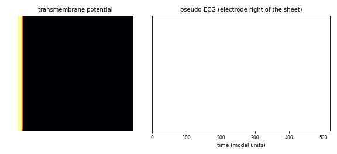
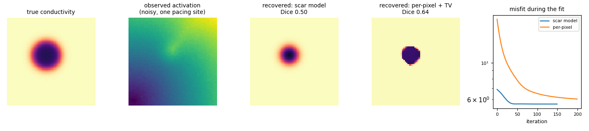

# cardiotorch

**A small, tested, differentiable 2D cardiac tissue simulator in PyTorch.**
It simulates electrical waves in heart tissue, including fibre direction, scar and spiral-wave arrhythmia,
and because every step is differentiable you can **fit tissue properties to data by gradient descent**.



*An S1–S2 protocol creates a re-entrant spiral wave, the 2D mechanism behind many tachycardias. The trace
on the right is the pseudo-ECG it produces.*

## What it does

- **Aliev–Panfilov excitable-tissue model** on a 2D grid, written in plain PyTorch. It runs on CPU or GPU
  and is batched.
- **Anisotropic conduction.** Each pixel has a fibre angle, along/across diffusivities and a conductivity
  map for scar and fibrosis. Diffusion is in conservative flux form with no-flux boundaries.
- **Readouts:**
  - a smooth, differentiable activation time per cell;
  - a pseudo-ECG at virtual electrodes (differentiable when given non-detached potentials).
- **Inverse problems:**
  - recover a hidden scar (centre, radius, contrast), or a full per-pixel conductivity map with
    total-variation regularisation;
  - gradient checkpointing keeps memory bounded over thousands of time steps.
- **Safety rails:**
  - the explicit time step is checked against the stability limit;
  - parameters are kept in range with sigmoids, so a fit cannot drive the simulation unstable.

## Quick start

```bash
pip install torch --index-url https://download.pytorch.org/whl/cpu   # or a CUDA build
pip install -e ".[examples,dev]"
pytest -q                                 # 14 physics/autodiff/API checks, about a minute on a CPU
python examples/spiral_wave.py            # writes assets/spiral.gif
python examples/recover_scar.py           # writes assets/scar_recovery.png
```

```python
import torch
from cardiotorch import Tissue, point_stimulus, simulate

tissue = Tissue((128, 128), d_long=1.0, d_trans=0.25, fibre_angle=0.5)   # fibres at ~29 degrees
u0 = point_stimulus((128, 128), [(64, 64)], radius=3)                     # pace from the centre
out = simulate(tissue, u0, dt=0.05, t_end=80)
out["act_time"]          # (1, 128, 128) activation times, differentiable w.r.t. the tissue
```

## Recovering a hidden scar

`examples/recover_scar.py` hides a scar, generates "measured" activation maps from four pacing sites, and
fits the scar back by back-propagating through the simulator. To avoid the *inverse crime*, the
measurement is simulated on a grid twice as fine, averaged down and corrupted with noise. The fit cannot
simply reproduce its own discretisation.



With the 4-parameter scar model, the scar **centre is recovered to within 0.2 grid cells**. The radius of
this very dense scar (10 % conductivity) is underestimated: the coarse fitting grid blocks conduction where
the fine measurement grid still conducts slowly. That model mismatch is real and is left visible on purpose.
Overlap with the true scar (Dice) is 0.50 for the scar model and 0.64 for the per-pixel map with
total-variation regularisation. The per-pixel fit is experimental (see [docs/theory.md](docs/theory.md)).

## What the tests check

| test | physics it verifies |
|---|---|
| `test_diffusion_conserves_mass` | with the reaction off, the flux-form operator conserves total charge exactly |
| `test_conduction_velocity_scales_with_sqrt_diffusivity` | 4× diffusivity gives about 2× wave speed |
| `test_anisotropy_follows_fibre_direction` | the along/across speed ratio is √(D_l/D_t); a 90° rotation reproduces the isotropic case |
| `test_unstable_time_step_is_rejected` | the stability guard |
| `test_gradients_match_finite_differences` | `torch.autograd.gradcheck` through the whole simulation (float64) |
| `test_checkpointing_gives_the_same_gradient` | memory saving does not change the gradient |
| `test_scar_parameters_are_recovered` | an end-to-end inverse fit converges to the true scar centre |
| `test_frames_are_identical_with_and_without_checkpointing`, `test_batch_matches_separate_runs` | API consistency: recording, checkpointing and batching do not change results |
| `test_stimuli_combine_and_are_validated`, `test_shapes_are_validated` | inputs are checked with clear errors instead of silent misbehaviour |

## Design notes

- **Flux form.** Currents are computed on cell faces, and the boundary faces carry none. Face currents
  telescope, so the scheme is exactly conservative, which is tested.
- **Stability.** Explicit Euler needs `dt · D_max / dx² ≤ 1/4` in 2D. Anisotropic cross terms tighten
  that, so `simulate` enforces 0.2.
- **Smooth activation time.** A threshold crossing has no useful gradient. cardiotorch integrates
  `1 − m(t)`, where `m` is a running maximum of `sigmoid((u − θ)/τ)`, so the activation time changes
  smoothly with the tissue.

## Limitations

- 2D sheet, phenomenological model, dimensionless units. No torso, no 3D anatomy, no clinical claims.
- Explicit Euler only. Very fine grids need very small time steps.

## Related work

cardiotorch is a compact teaching and prototyping tool. It does not claim to be the first differentiable
cardiac simulator.

- Kashtanova et al., *Simultaneous data assimilation and cardiac electrophysiology model correction using
  differentiable physics and deep learning*, Interface Focus 2023,
  [doi:10.1098/rsfs.2023.0043](https://doi.org/10.1098/rsfs.2023.0043)
- [EP-PINNs](https://github.com/martavarela/EP-PINNs): physics-informed neural networks for the same model
- [TorchCor](https://github.com/sagebei/torchcor): GPU finite-element cardiac simulation in PyTorch
- [Finitewave](https://github.com/finitewave/Finitewave): finite-difference cardiac simulation in Python

## References

- Aliev R.R., Panfilov A.V. *A simple two-variable model of cardiac excitation.* Chaos, Solitons & Fractals
  7(3):293–301, 1996. [doi:10.1016/0960-0779(95)00089-5](https://doi.org/10.1016/0960-0779(95)00089-5)
- Clayton R.H. et al. *Models of cardiac tissue electrophysiology: progress, challenges and open
  questions.* Prog Biophys Mol Biol 104:22–48, 2011.
  [doi:10.1016/j.pbiomolbio.2010.05.008](https://doi.org/10.1016/j.pbiomolbio.2010.05.008)

## License

MIT
